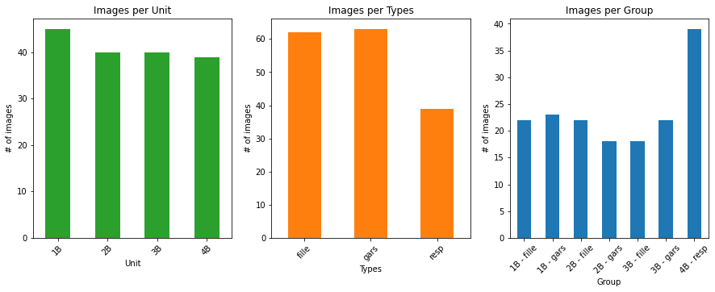
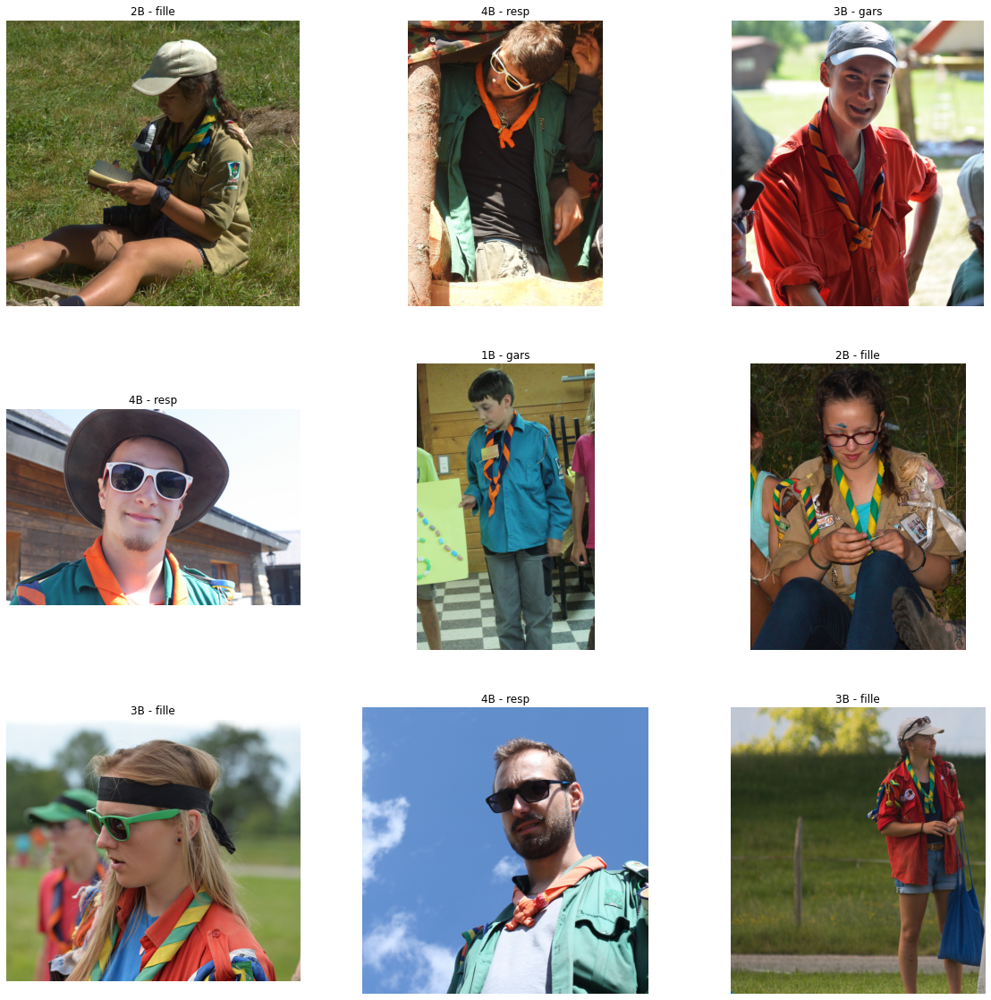

---
title: "Object recognition in the wild using Convolutional Neural Networks"
subtitle: "Practical Work 05"
author: "Francesco Monti"
date: 20.05.2022
header-center: "Object recognition in the wild using Convolutional Neural Networks"
toc-own-page: true
...

# Introduction
The goal of this project is to create an application that can recognize different age groups and units of a swiss Scout Brigade. The *Brigade des Flambeaux de l'Évangile* [^1] is a cluster of 15 groups located in the french-speaking part of Switzerland. There are currently around 900 active members. The images that we will use are publicly available images to comply to the permissions given by the parents regarding the usage of those images. We will need to collect at least 700 images (100 for each possible outcome), but depending on how far we will take the classification we could need 1000 images at least. We will use an existing model, namely `MobileNetV2`, provided by the **Keras** package. We will probably need to do some data augmentation as we are not sure to be able to get 1000 usable images. To help ourselves with the dat preparation and the creation of the model, we will use the comprehensive guide on the **Keras** website [^2].

[^1]: [https://www.flambeaux.ch](https://www.flambeaux.ch/presentation/qui-sommes-nous/)
[^2]: [https://keras.io/guides/transfer_learning/](https://keras.io/guides/transfer_learning/)

# The problem
This problem will be a *Multi-Label Classification* problem because we have the following classes:

#### Uniform color (age group)
- `[0]` **Blue**: *Petits-Flambeaux (M) / Petites-Flammes (F)* -> Participants
- `[1]` **Beige**: *Flambeaux (M) / Claires-Flammes (F)* -> Participants
- `[2]` **Red**: *Pionniers (M) / Cordées (F)* -> Participants
- `[3]` **Green**: *Responsables (M/F)* -> Leaders

#### Neckerchief color (gender)
- `[0]` **Blue and orange**: Male participants
- `[1]` **Green and yellow**: Female participants
- `[2]` **Full orange**: Male and female leaders

The total outcomes can be represented as such (first digit is age, second is gender) : `(0,0), (0,1), (1,0), (1,1), (2,0), (2,1), (3,2)` -> 7 possible outcomes.

Depending on how much images we find that have both the shirt and the neckerchief, we could backup to a *Single-Label Classification*. It's easier to find images with neckerchiefs rather than with the uniform (mainly because of the hot temperatures in the summer, when we take the most pictures).

# Data preparation

After collecting the needed images, and after filtering we end up with 122 total images. Which is really not a lot. We started from approximatly 1000 original pictures. A lot were discarded because they didn't contain the wanted subjets (landscapes for instance), were too complex or just not tailored to our needs. We will make use of Data Augmentation to add more training data to the model.

## Repartition

Here is the repartition of the different classes:


We can see that if the take the subdivision in the 7 possible classes we have a large number of images (a third) that is only for the `[4B - resp]` class. This is due to the fact the the subclass `[4B]` is only associated to the `[resp]` subclass. The numerical values of the plots above are the following:

```
Unit:             Types:               Group:
1B    31          fille    36          1B - fille     8
2B    27          gars     42          1B - gars     23
3B    20          resp     44          2B - fille    16
4B    44                               2B - gars     11
                                       3B - fille    12
                                       3B - gars      8
                                       4B - resp     44
```

As the images repartition is not ideal, we need to find a little more images. After looking through 1400 more pictures, we found 52 more usable pictures. It is not a lot, but the pictures were older and the a lot did not contain the wanted subjects. Nonetheless, we have a pretty much balanced dataset of 164 pictures now. It should be enough data to train our model. Here is the summary of the new dataset:



The numerical values of the plots above are the following:

```
Unit:             Types:               Group:
1B    45          fille    62          1B - fille    22
2B    40          gars     63          1B - gars     23
3B    40          resp     39          2B - fille    22
4B    39                               2B - gars     18
                                       3B - fille    18
                                       3B - gars     22
                                       4B - resp     39
```

Here are a few samples of the dataset :




With this dataset we will now proceed to the data augmentation itself.

- https://pyimagesearch.com/2019/07/08/keras-imagedatagenerator-and-data-augmentation/

# Model creation
- https://pyimagesearch.com/2018/05/07/multi-label-classification-with-keras/

# Results

# Conclusion
